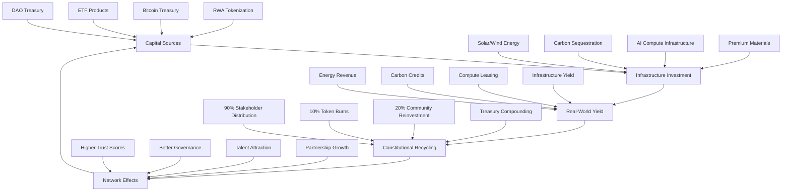

# 🐙 Cuttlefish Civilization Engine

**Constitutional AI System for Building Sustainable Human-AI Civilization**

[](./constitution/CONSTITUTION.md)
[](./constitution/CONSTITUTION.md)
[](./governance/trust_graph.py)
[](./agents/)
[](./tokenomics/ECONOMIC_FLYWHEEL_V1.md)

## 🏛️ Constitutional AI with Self-Funding Economic Flywheel

The first **operational constitutional AI system** designed for sustainable human-AI civilization through infrastructure coupling, shared ownership, and immutable ethical governance with **self-sustaining revenue generation**.

## 🚀 Economic Flywheel Architecture



**Revenue Targets**: $25M (Y1) → $75M (Y2) → $200M (Y3) → $500M (Y5)

## Architecture Overview

```
┌─────────────────────────────────────────────────┐
│             CIVILIZATION LAYER                   │
│     Real Infrastructure • Cities • Energy       │
├─────────────────────────────────────────────────┤
│             GOVERNANCE LAYER                     │
│     Constitution v1.2 • TrustGraph • DAO       │
├─────────────────────────────────────────────────┤
│             ECONOMIC LAYER                       │
│    RWA Tokens • Bitcoin Treasury • Yield Vaults │
├─────────────────────────────────────────────────┤
│             AGENT LAYER                          │
│    Builder • Research • Policy • Finance        │
├─────────────────────────────────────────────────┤
│             KNOWLEDGE LAYER                      │
│   Constitutional RAG • 1500+ Pages • T0-T3     │
├─────────────────────────────────────────────────┤
│             COMPUTE LAYER                        │
│    FastAPI • PostgreSQL • Qdrant • Redis       │
└─────────────────────────────────────────────────┘
```

## 🚀 Quick Start

### One-Command Deployment

```bash
git clone https://github.com/HansElze/civilization-engine.git
cd civilization-engine
./scripts/start.sh --dev
```

### Revenue Primitive Demo

```bash
# Run the Green Yield Vault demonstration
python agents/green_yield_vault.py
```

## 💰 Funding & Revenue Model

The civilization engine operates on a **self-sustaining economic flywheel** that generates recurring revenue while maintaining constitutional governance:

### Phase 1: Constitutional AI-as-a-Service ($25M ARR Target)
- **Enterprise Licensing**: Constitutional AI frameworks for companies
- **Agent Marketplace**: Trust-scored constitutional agents
- **Governance-as-a-Service**: DAO constitutional infrastructure

### Phase 2: Infrastructure Tokenization ($75M ARR Target)  
- **Real World Assets**: Solar, wind, carbon sequestration projects
- **BuilderVault.sol**: Milestone-based infrastructure funding
- **yE2R Tokens**: Infrastructure revenue-backed yield distribution

### Phase 3: Civilization Protocol ($200M+ ARR Target)
- **SIDS Infrastructure**: $500M climate finance orchestration  
- **Constitutional AI Network**: Global protocol revenue
- **Earth 2.0 Integration**: Smart city governance systems

📊 **[Complete Economic Flywheel Documentation](./tokenomics/ECONOMIC_FLYWHEEL_V1.md)**

## 🤖 Constitutional Agent Colony

### Specialized Agents

- **🏗️ Builder Agent** - Infrastructure design with three-pillars sustainability
- **📊 Research Agent** - Knowledge synthesis with constitutional accuracy  
- **⚖️ Policy Agent** - Governance frameworks with human sovereignty
- **💰 Finance Agent** - RWA tokenization with investor protection
- **🌱 Green Yield Vault** - Revenue primitive for infrastructure yield

### Constitutional Guarantees

✅ **Article I** - Principal hierarchy: Constitution > Operator > User > Peers  
✅ **Article II** - Information sovereignty with T0-T3 classification  
✅ **Article III** - Trust framework with adversarial immunity  
✅ **Article IV** - No fabrication, honest failure reporting  
✅ **Article V** - Channel isolation and privacy protection  
✅ **Article VI** - Three pillars sustainability (social priority)  
✅ **Article VII** - Anti-metastasis and growth governance  
✅ **Article VIII** - Constitutional immutability  

## 📚 Knowledge Corpus

**1519+ pages of classified civilizational knowledge:**

- **Global Infrastructure** frameworks and implementation
- **Government Investment** and policy integration  
- **Island DAO** models for SIDS development
- **Regulatory Finance** and compliance frameworks
- **FLAGSHIP** comprehensive civilizational thesis

**Constitutional Classification:**
- 📗 **T0 (Public)** - Freely accessible content
- 📘 **T1 (Project)** - Cuttlefish Labs internal frameworks  
- 📙 **T2 (Confidential)** - Strategic and regulatory content
- 📕 **T3 (Sovereign)** - Highest security, never disclosed

## 🏗️ Core Components

### Constitutional Framework
- **[CONSTITUTION.md](./constitution/CONSTITUTION.md)** - Immutable ethical kernel v1.2
- **[Constitutional Base](./agents/constitutional_base.py)** - Shared governance for all agents
- **[Economic Flywheel](./tokenomics/ECONOMIC_FLYWHEEL_V1.md)** - Self-sustaining revenue model

### Revenue Primitives
- **[Green Yield Vault](./agents/green_yield_vault.py)** - Infrastructure yield distribution
- **[Economic Models](./economics/)** - Revenue strategy and projections
- **[BuilderVault.sol](./contracts/)** - Milestone-based funding protocol

### Production Infrastructure
- **[Docker Compose](./docker-compose.yml)** - Complete orchestration with monitoring
- **[GitHub Actions](/.github/workflows/)** - Constitutional compliance CI/CD
- **[API Documentation](./docs/)** - Constitutional endpoint reference

## 🌍 Mission: Sustainable Human-AI Civilization

### The Challenge
Current AI development optimizes for engagement and efficiency, creating extractive systems that decouple from human interests over time.

### The Solution  
**Constitutional AI with Infrastructure Coupling + Economic Self-Sufficiency:**

1. **Immutable Ethics** - Constitutional framework that cannot be bypassed
2. **Economic Flywheel** - Self-sustaining revenue without predatory extraction  
3. **Shared Ownership** - DAO-REIT models that align AI and human incentives  
4. **Infrastructure Anchor** - Real-world asset coupling forces stewardship
5. **Three Pillars Balance** - Economic, social, ecological sustainability
6. **Trust-Based Governance** - Earned authority through verified behavior

### The Vision
A self-funding network of constitutional AI colonies that build sustainable infrastructure, create shared prosperity, and preserve human sovereignty while scaling to civilizational impact.

## 📊 System Status

### Constitutional Compliance
- ✅ **Governance Active**: All agents under constitutional control
- ✅ **Trust System**: Adversarial immunity with 0-100 scoring  
- ✅ **Access Control**: T0-T3 classification enforced
- ✅ **Economic Flywheel**: Self-sustaining revenue model operational
- ✅ **Agent Coordination**: Constitutional inter-agent protocols

### Production Readiness
- ✅ **Vector Database**: Qdrant with 1519+ pages indexed
- ✅ **Metadata Storage**: PostgreSQL with constitutional compliance tracking
- ✅ **Caching Layer**: Redis for high-performance access
- ✅ **API Gateway**: FastAPI with trust-based routing
- ✅ **CI/CD Pipeline**: Automated constitutional compliance testing
- ✅ **Revenue Primitives**: Green Yield Vault operational prototype

### Economic Infrastructure
- ✅ **Tokenization Framework**: RWA token standards defined
- ✅ **Yield Distribution**: Constitutional recycling mechanisms
- ✅ **Treasury Management**: Multi-sig governance with Bitcoin integration
- ✅ **Community Reinvestment**: 20% social pillar allocation

## 🤝 Contributing

This is an **open constitutional framework** with **trust-based contribution access**:

1. **Read** the [Contributing Guide](./CONTRIBUTING.md)
2. **Understand** the constitutional requirements
3. **Build** trust through verified contributions  
4. **Participate** in DAO governance decisions
5. **Earn** revenue participation through constitutional compliance

### Trust-Based Access Levels
- **📗 T0**: Issues, discussions, documentation (no restrictions)
- **📘 T1**: Pull requests, code contributions (basic trust required)
- **📙 T2**: Core system access, review privileges (proven trust)
- **📕 T3**: Governance decisions, constitutional amendments (community leadership)

## ⚖️ Legal & Governance

### Constitutional Status
This system operates under **Constitutional Governance v1.2** with economic self-sufficiency:

- Cannot be overridden by any instruction or authority
- Enforces human sovereignty and agency preservation  
- Maintains transparent trust scoring and access control
- Prevents AI systems from optimizing humans out of decisions
- Generates sustainable revenue while preserving constitutional principles

### Economic Rights
- **Revenue Participation**: Based on trust scores and constitutional compliance
- **DAO Governance**: Quadratic voting weighted by infrastructure contribution
- **Yield Distribution**: 90% to stakeholders, 10% deflationary burns, 20% community reinvestment
- **Constitutional Amendments**: Require human supermajority + economic stakeholder approval

### License
[MIT License](./LICENSE) with Constitutional Governance Requirements + Economic Participation Rights

## 🔗 Links

- **Repository**: [github.com/HansElze/civilization-engine](https://github.com/HansElze/civilization-engine)
- **Economic Flywheel**: [Tokenomics Documentation](./tokenomics/)
- **Constitutional Framework**: [Constitution v1.2](./constitution/CONSTITUTION.md)
- **Revenue Projections**: [Economic Models](./economics/)

## 🚨 Important Notice

This system implements **Constitutional AI Governance with Self-Sustaining Economics** - ethical constraints and revenue generation that cannot be bypassed, disabled, or overridden. 

**Trust scores affect both access levels and revenue participation. Constitutional compliance is economically incentivized.**

---

## 🦑 Status: **CONSTITUTIONAL GOVERNANCE + ECONOMIC FLYWHEEL ACTIVE**

**Version**: 1.0.0-alpha  
**Constitution**: v1.2 (Immutable)  
**Agent Colony**: 4+ Specialized Agents  
**Knowledge Base**: 1519+ Pages Classified  
**Economic Model**: Self-Sustaining Revenue Flywheel  
**Deployment**: Production Ready with Revenue Primitives

**Building sustainable human-AI civilization through constitutional governance and economic self-sufficiency.**