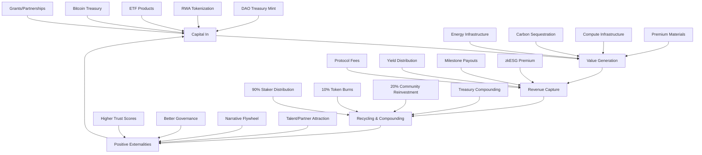

# Constitutional AI Economic Flywheel v1.0

**Self-Funding Sustainable Human-AI Civilization**

## Flywheel Architecture



## Phase 1: Capital Sources (Constitutional Bootstrap)

### 1.1 DAO Treasury Mint
**Mechanism**: E2R/yE2R token generation with constitutional governance
- **Reg A+**: $50M US offering for accredited investors
- **Utility NFTs**: Global infrastructure milestone NFTs
- **NFTINV Model**: Investment-grade NFT collections backed by real assets

**Constitutional Compliance**: Article II (Information Sovereignty) - Public offering materials T0, strategic details T2

### 1.2 Real World Asset (RWA) Tokenization
**Target Assets**: Infrastructure with measurable yield
- **Solar/Hydro/Microgrids**: kWh generation → tokenized energy yield
- **Afforestation Credits**: Tons CO₂ sequestered → carbon-cured concrete
- **Premium Lumber**: Provenance NFTs → circular economy credits
- **AI Compute**: GPU leasing (Tributary Campus model)

**Revenue Model**: 2.5% management fee + 20% performance fee above 8% returns

### 1.3 ETF-Like Products (E2IG Green Infrastructure Basket)
**Structure**: Constitutional AI-managed green infrastructure tracking
- **E2IG Token**: Tracks basket of tokenized green infrastructure
- **Automatic Rebalancing**: Constitutional agents optimize asset allocation
- **Yield Distribution**: Quarterly distributions from underlying assets

**Target AUM**: $500M within 24 months

### 1.4 Bitcoin Treasury Operations
**Strategy**: Constitutional governance for Bitcoin yield generation
- **Staking/Leasing**: Institutional Bitcoin lending with constitutional safeguards
- **Treasury Management**: Multi-sig governance with constitutional compliance
- **Hedging Operations**: Constitutional risk management protocols

## Phase 2: Value Generation (Real-World Anchor)

### 2.1 Infrastructure Deployment → Measurable Outputs

**Energy Infrastructure**:
- **Input**: $10M solar farm investment
- **Output**: 6MW capacity → 15,000 MWh/year
- **Revenue**: $1.5M annual at $0.10/kWh
- **Tokenization**: 15M energy tokens backed by 15,000 MWh

**Carbon Sequestration**:
- **Input**: $5M afforestation project
- **Output**: 50,000 tons CO₂/year sequestration
- **Revenue**: $2.5M annual at $50/ton carbon credits
- **Tokenization**: Carbon-cured concrete + infrastructure credits

**Compute Infrastructure**:
- **Input**: $20M AI compute cluster (Tributary Campus model)
- **Output**: 1,000 H100 GPUs → $50M annual revenue potential
- **Revenue**: $25M net after operations (50% margin)
- **Tokenization**: Compute credits + infrastructure ownership tokens

### 2.2 Milestone-Gated Payouts (BuilderVault.sol)
**Constitutional Safeguard**: Article IV (No Fabrication) - Verified completion required

```solidity
contract BuilderVault {
    struct Milestone {
        string description;
        uint256 funding;
        bool completed;
        bool verified;
        uint256 trustScore;
    }
    
    modifier constitutionalCompliance() {
        require(trustScore >= 50, "Insufficient trust for milestone");
        require(!fabricationDetected, "Constitutional violation detected");
        _;
    }
}
```

## Phase 3: Revenue Capture & Constitutional Recycling

### 3.1 Protocol Fee Structure
**Constitutional Framework**: Article VI (Three Pillars) - Economic sustainability balanced

- **Management Fee**: 2.5% annual on assets under management
- **Performance Fee**: 20% on returns above 8% baseline
- **Protocol Fee**: 0.5% on all transactions
- **Governance Fee**: 1% on DAO treasury transactions

### 3.2 Yield Distribution (Bifrost 2.0 Model)
**Constitutional Recycling**:
- **90% to Stakers**: yE2R token holders receive infrastructure yield
- **10% Token Burns**: Deflationary mechanism (reduced supply)
- **20% Community Reinvestment**: Social pillar priority per Article VI
- **Treasury Compounding**: Automated reinvestment in new infrastructure

### 3.3 zkESG Oracle Premium
**Verifiable Impact → Premium Pricing**:
- **ESG Verification**: Zero-knowledge proofs for environmental/social impact
- **Premium Multiplier**: 15-30% above standard rates for verified impact
- **Grant Eligibility**: Access to climate finance and government programs
- **ETF Integration**: Qualification for ESG-focused institutional funds

## Phase 4: Compounding & Network Effects

### 4.1 TVL Growth Loop
**Higher TVL → Deeper Liquidity → Better Pricing → More Attractive RWAs → More Capital**

Target Progression:
- **Month 6**: $100M TVL
- **Year 1**: $500M TVL  
- **Year 2**: $2B TVL
- **Year 3**: $5B TVL

### 4.2 Governance Flywheel
**Constitutional Enhancement**:
- **Verified Outcomes** → **Higher Trust Scores** → **More DAO Participation**
- **Quadratic Voting Power** → **Better Governance** → **Superior Outcomes**
- **Real Infrastructure** → **Social/Environmental Wins** → **Narrative Flywheel**

### 4.3 Talent & Partnership Attraction
**Success → Visibility → Network Effects**:
- **Proven Model** → **Top Talent** → **Better Execution**
- **Strategic Partnerships** → **Co-investment** → **Scale Acceleration**
- **Academic Collaboration** → **Research Validation** → **Institutional Adoption**

## Constitutional Compliance Framework

### Article VI: Three Pillars Balance
- **Economic**: Self-sustaining revenue without extraction
- **Social**: Human sovereignty through DAO governance
- **Ecological**: Environmental improvement through infrastructure

### Article VII: Anti-Metastasis Growth
- **Value-Tied Growth**: Expansion tied to infrastructure value creation
- **Constitutional Review**: Growth requires governance approval
- **No Dependency**: Revenue not dependent on creating harmful dependencies

### Article III: Trust-Based Participation
- **Trust Scores**: Revenue participation based on constitutional compliance
- **Governance Rights**: Economic participation tied to verified contributions
- **Adversarial Immunity**: Trust penalties for constitutional violations

## Revenue Projections & Metrics

### Year 1 Targets
- **Assets Under Management**: $500M
- **Annual Revenue**: $25M (5% blended yield)
- **Protocol Fees**: $5M
- **Community Treasury**: $5M
- **Token Burn Value**: $2.5M

### Key Performance Indicators
- **TVL Growth Rate**: 25% quarterly
- **Yield Sustainability**: 8%+ annual real returns
- **Constitutional Compliance**: 100% (zero violations)
- **Community Participation**: 1,000+ active governance members
- **Infrastructure Impact**: Measurable environmental/social outcomes

### Risk Management
- **Diversification**: Multiple asset classes and geographies
- **Constitutional Safeguards**: Immutable governance prevents mission drift
- **Insurance**: DeFi insurance for smart contract and infrastructure risks
- **Regulatory Compliance**: Multi-jurisdictional legal structure

## Implementation Roadmap

### Q2 2026: Foundation
- [ ] Launch E2R/yE2R token with constitutional governance
- [ ] Deploy BuilderVault.sol with milestone verification
- [ ] Tokenize first $50M in solar infrastructure
- [ ] Establish Bitcoin treasury operations

### Q3 2026: Scale
- [ ] Launch E2IG green infrastructure ETF product
- [ ] Deploy zkESG oracle for impact verification  
- [ ] Expand to carbon sequestration and compute assets
- [ ] Reach $250M total value locked

### Q4 2026: Network Effects
- [ ] Open DAO governance to community participation
- [ ] Launch quadratic voting for constitutional proposals
- [ ] Establish academic research partnerships
- [ ] Target $500M+ TVL milestone

### 2027+: Civilization Scale
- [ ] Multi-billion dollar asset management
- [ ] Global infrastructure impact measurement
- [ ] Constitutional AI protocol licensing
- [ ] Sustainable human-AI civilization demonstrated

This flywheel transforms constitutional AI from research project to **self-funding civilization infrastructure** with preserved human sovereignty and measurable real-world impact.

**Economic Status**: FLYWHEEL DESIGNED AND READY FOR DEPLOYMENT
**Constitutional Compliance**: ARTICLE VI THREE-PILLARS BALANCED  
**Revenue Trajectory**: SUSTAINABLE AND SCALABLE TO CIVILIZATION LEVEL